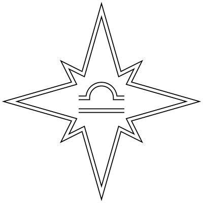

# astrea



Header-only C++17 library for statistical equilibrium calculations in plasma.
Supports the following detailed balance pairs: collisional bound-bound
transitions, collisional ionization-three-body recombination, radiative
bound-bound transitions, photoionization-radiative recombination-dielectronic
recombination, charge transfer ionization-recombination, and spontaneous
emission.

## Installation

### Using Conan

Add repo:

```sh
conan remote add astro https://gitea.zarux.ru/api/packages/astro/conan
```

Insall package:

```sh
conan install --remote=astro --requires=astrea/<VERSION>
```

### Other

You can clone, use as submodule, or download this repo.

```sh
git clone https://gitea.zarux.ru/astro/astrea
```

Next, install the following dependencies:

- [Boost](https://www.boost.org/) (or header-only versions
  [Boost.Math](https://gitea.zarux.ru/astro/boost-math),
  [Boost.Units](https://gitea.zarux.ru/astro/boost-units))
- [Eigen](https://eigen.tuxfamily.org/index.php?title=Main_Page)
- [fm](https://gitea.zarux.ru/astro/fm)
- [ni](https://gitea.zarux.ru/astro/ni)

## Documentation

Library has the following main parts: **Data** ([Elements](#elements),
[Spectrum](#spectrum)) and [Statistical Equilibrium](#statistical-equilibrium).

> This guide describes only main use cases.
> Detailed description of functions' arguments and classes' fields can be found
> in header files.

### Statistical Equilibrium

Two approximations are available for calculating populations of electron levels:
LTE (local thermodynamical equilibrium) and NLTE (non-local themodynamical
equilibrium).

#### LTE

LTE can be calculated using only Boltzmann distribution, or Boltzmann
distribution and Saha ionization equation. Resulting population has the
`Eigen::VectorXd` type.

Further it will be assumed that [Elements](#elements) and [Spectrum](#spectrum)
are initialized and the library is included (`#include <astrea/astrea.h>`).

```c++
auto temperature = 1.0e4; // kelvin
auto boltzmann = astrea::lte_boltzmann_population(elements, temperature);

auto temperature = 1.0e4; // kelvin
auto electron_temperature = 1.0e4; // kelvin
auto electron_number_density = 1.0e5; // centimeter^{-3}
auto boltzmann_saha = astrea::lte_boltzmann_saha_population(
  elements,
  temperature
  electron_temperature,
  electron_number_density
);
```

#### NLTE

NLTE calculation of current electron population requires rates matrix that can
be composed using [Transitions](#transitions), time step, and previus electron
population.

```c++
#include <Eigen/Dense>

Eigen::VectorXd population_1;
population_1 << /* Size must be equal to sum of all elements' keys */;
auto delta_time = 1.0e-2; // second
auto rates_matrix = /* See Transitions section */;
auto population_2 = astrea::nlte_population(
  population_1,
  delta_time,
  rates_matrix
);
```

##### Transitions

Here will be used the following abbreviations: **CBB** - collisional
bound-bound, **CI** - collisional ionization, **CTI** - charge transfer
ionization, **CTR** - charge transfer recombination, **DR** - dielectronic
recombination, **PI** - photoionization, **RBB** - radiative bound-bound,
**RR** - radiative recombination, **SE** - spontaneous emission, **TBR** -
three-body recombination.

Final rates matrix is a sum of per-process rate matrix:

```c++
auto ci = astrea::ci_hahn_rates(
  elements,
  electron_temperature,
  electron_number_density
);
auto tbr = astrea::tbr_hahn_rates(
  elements,
  electron_temperature,
  electron_number_density
);
/* ... */

auto rates_matrix = ci + tbr /* + ... */;
```

The following transitions rates functions are available:

- `astrea::cbb_mashonkina_o1_rates`
- `astrea::cbb_regemorter_rates`
- `astrea::ci_arnaud_younger_rates`
- `astrea::ci_hahn_rates`
- `astrea::cti_arnaud_rates`
- `astrea::ctr_arnaud_rates`
- `astrea::dr_badnell_rates`
- `astrea::pi_mashonkina_o1_rates`
- `astrea::rbb_mashonkina_doppler_o1_rates`
- `astrea::rbb_mashonkina_voigt_o1_rates`
- `astrea::rbb_tasitsiomi_rates`
- `astrea::rr_badnell_verner_rates`
- `astrea::rr_seaton_rates`
- `astrea::se_nist_o1_rates`
- `astrea::tbr_hahn_rates`

### Elements

Elements typically passed to statistical equilibrium functions as a
`std::vector` of `std::shared_ptr`.

```c++
#include <memory>
#include <vector>

auto o1_mashonkina = std::make_shared<astrea::O1Mashonkina>();
o1_mashonkina->keys({"12P3P4", "12P1D4"}); // Select only two levels
auto o2_mashonkina = std::make_shared<astrea::O2Mashonkina>();
o2_mashonkina->keys(o2_mashonkina->all_keys()); // Select all levels
std::vector<std::shared_ptr<astrea::Element>> elements = {
  o1_mashonkina,
  o2_mashonkina,
};
```

The following elements are available:

- `astrea::H1`
- `astrea::H2`
- `astrea::He1`
- `astrea::He2`
- `astrea::O1Mashonkina`
- `astrea::O2Mashonkina`

### Spectrum

Spectrum typically passed to statistical equilibrium functions as a
`std::shared_ptr`.

```c++
#include <memory>

auto spectrum = std::make_shared<astrea::SunGueymard>();
```

The following syntetic spectra are available:

- `astrea::BlackBodyPlanck` (`temperature` and `total_area` must be specified)

The following observed spectra are available:

- `astrea::Kelt9Fossati`
- `astrea::SunGueymard`

## License

License: [GPL-3](./LICENSE)  
Author: Artem Shepelin (4.shepelin@gmail.com)